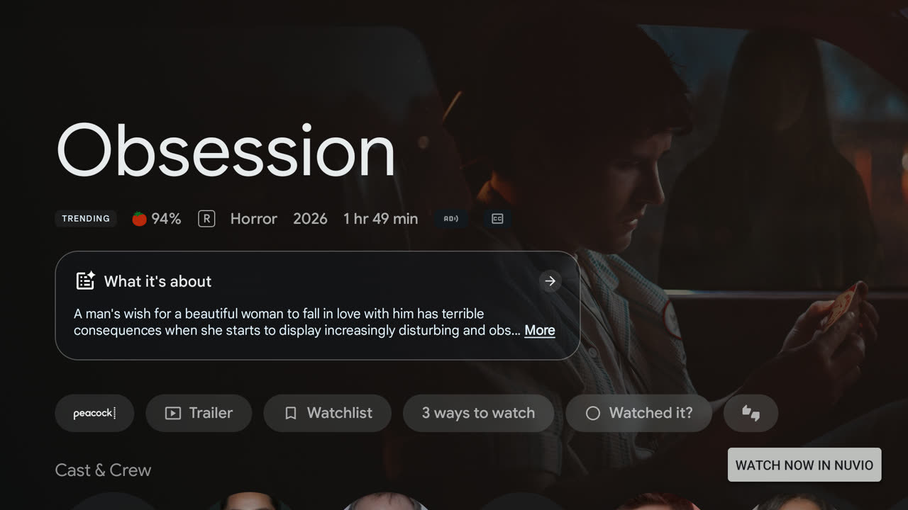
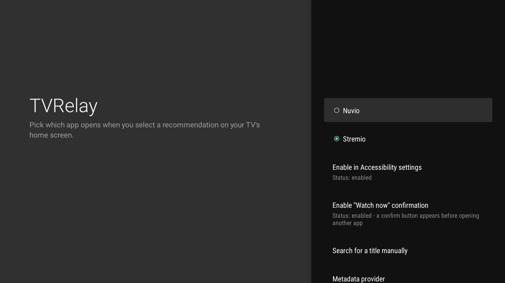
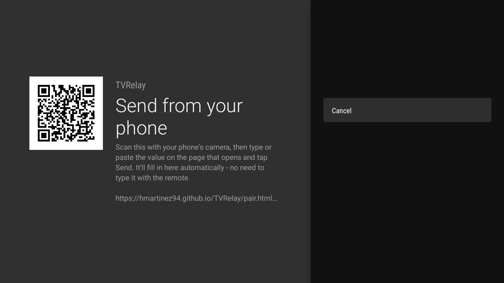

# TVRelay

[](../../releases)
[](LICENSE)

Google TV's home screen recommends a movie, you click it, and it opens whatever app the recommendation happened to come from - usually not the one you actually wanted to watch it in. TVRelay intercepts that click and opens the title in **Nuvio** or **Stremio** instead, with a one-tap confirmation so a stray click never redirects you by accident.



*A real recommendation page, with TVRelay's confirm button floating over it.*

Free, no account, no subscription, no license check. It doesn't host or provide any content itself; it only reads the title of the thing you clicked, looks that title up, and hands you off to an app you already chose in Settings.

## Contents

- [How it works](#how-it-works)
- [Requirements](#requirements)
- [Installation](#installation)
- [Setup](#setup)
- [Metadata provider](#metadata-provider-tmdb--thetvdb)
- [Limitations](#limitations)
- [Troubleshooting](#troubleshooting)
- [Building from source](#building-from-source)
- [Legal notice](#legal-notice)
- [Credits](#credits)

## How it works

Android's Accessibility API lets an app observe what's on screen for assistive purposes - TVRelay uses it narrowly, watching only for clicks on the Google TV launcher. When a click's payload includes a movie/show title, TVRelay looks it up (via [TMDB](https://www.themoviedb.org/) by default, or optionally TheTVDB) and offers to open it in your chosen player. Every other click - app icons, menus, anything that isn't a recommendation - is left completely alone, and nothing is read, stored, or sent anywhere beyond that one lookup.

Not every recommendation card exposes a title this way; see [Limitations](#limitations).

## Requirements

- A device with the **Google TV** launcher (Chromecast with Google TV, or Google TV editions from Sony, TCL, Hisense, etc.). Fire TV is not currently supported - see [Limitations](#limitations).
- **Nuvio** and/or **Stremio** installed on the device.

## Installation

TVRelay isn't on Google Play yet - install the APK from this repository's [Releases](../../releases) page.

### Option A: from your phone, using Send Files to TV

1. On the TV, install **[Send Files to TV](https://play.google.com/store/apps/details?id=com.jstenpal.sendfilestotv)** from Google Play.
2. Open the app on the TV. It will show an address or a QR code to connect from your phone.
3. From your phone's browser, go to that address and select the APK downloaded from [Releases](../../releases).
4. Once the file has transferred, the TV will let you start the installation.
5. If Android TV shows a warning about installing from an unknown source, temporarily allow installation from that source.

### Option B: via ADB

1. Download the APK from [Releases](../../releases).
2. Enable developer options on the TV: **Settings → Device Preferences → About → tap "Build" 7 times**.
3. Enable **USB debugging** or **Network debugging**, depending on the device.
4. From your computer:
   ```
   adb connect <tv-ip>:5555
   adb install app-release.apk
   ```

## Setup



Open **TVRelay** from the TV's launcher, accept the first-run disclosure, pick Nuvio or Stremio as your player, then work through the two toggles below.

### Enable in Accessibility settings

Select **"Enable in Accessibility settings"** and turn the service on there. This is the permission that lets TVRelay see launcher clicks at all - without it, nothing else in this app does anything.

#### The toggle turns itself off immediately

On Android 13 and newer, the system blocks any sideloaded app (anything not installed from an app store, which currently includes TVRelay) from enabling Accessibility by default, as a security measure. If the toggle switches itself back off right after you enable it - sometimes immediately, sometimes a few seconds later, with no warning - this is why.

On some devices you can lift this from **Settings → Apps → TVRelay → app info screen**, by looking for an option along the lines of "Allow restricted setting" (the exact wording and location varies by manufacturer). If you find it, enable it, then go back into Accessibility and enable the service again.

**If you can't find any such option** (this is the case on the Google TV Streamer, for example), you'll need the ADB workaround instead:

```
adb connect <tv-ip>:5555
adb shell settings put secure enabled_accessibility_services com.hmartinez94.tvrelay/com.hmartinez94.tvrelay.TvRelayAccessibilityService
adb shell settings put secure accessibility_enabled 1
```

This writes the setting directly at the system level, which isn't subject to the same restriction as the Settings app toggle. Note the second command **replaces** the whole list of enabled accessibility services - if you already use another one (like TalkBack), separate them with a colon (`:`) instead of overwriting it.

If setting up ADB from a computer sounds like a hassle, **[atvTools](https://play.google.com/store/apps/details?id=dev.vodik7.atvtools)** (free, on Google Play) does the same thing from your phone.

On some devices (especially Chinese-manufacturer Android TV boxes with aggressive battery managers), you may also need to exclude TVRelay from any manufacturer "optimizer"/RAM cleaner, or the system will kill the service's process after a few seconds.

### Enable the "Watch now" confirmation

By default, TVRelay shows a **"Watch now in {App}"** button before opening anything - a loading indicator appears the moment you click a recommendation, then swaps to the confirm button once the title's been identified. It disappears on its own after about 10 seconds if you don't tap it, so an accidental click never silently redirects you.

This needs the **"Display over other apps"** permission, since the button is a small overlay drawn on top of whatever the launcher navigates to. Grant it from Settings → **"Enable 'Watch now' confirmation"**, which takes you straight to the right system screen.

**Without that permission**, TVRelay falls back to opening your chosen app immediately, with no confirmation step - it still works, just without the accidental-click protection.

## Metadata provider (TMDB / TheTVDB)

TVRelay uses **[TMDB](https://www.themoviedb.org/)** by default to identify a clicked title, using a key bundled with the app - no setup needed. If you'd rather use your own personal TMDB key instead (for example, if the shared default key is ever rate-limited), enter one from Settings → **Metadata provider** (get one free at [themoviedb.org](https://www.themoviedb.org/), under Settings → API) - it'll take priority over the bundled one automatically. **TheTVDB** is also available as an alternative provider if TMDB ever gives you a wrong match for a title.



Typing a 32-character key with a TV remote is painful, so that screen has a **"Send key from phone…"** option: scan the QR code, type or paste the key on the page that opens, and it fills in on the TV automatically within a few seconds - no remote typing required.

## Limitations

- **Fire TV is not currently supported.** Tested end-to-end on a real Fire TV Stick, and recommendation clicks never reach TVRelay's detection at all - almost certainly because Amazon's newly-redesigned Fire TV home screen (rolling out through 2026) doesn't expose standard Android accessibility events to third-party apps the way Google TV's launcher does. No known workaround; TVRelay is Google TV only for now.
- **WuPlay isn't supported as a player.** Its only deep link is for switching profiles remotely, not for opening a specific title - there's currently no way for TVRelay (or anything else) to hand it a title to open directly.
- **Some recommendation cards can't be detected automatically** - a real limitation of what the launcher exposes to accessibility tools, not a TVRelay bug, and there's no way to fix it from the app's side. If clicking a recommendation does nothing at all, use Settings → **"Search for a title manually"**: type the title yourself, and everything after that works exactly the same way as an automatically-detected click.
- **Voice search isn't detected.** Using the launcher's mic to speak a title jumps straight to that title's page without any click TVRelay can see - a different limitation from the one above, and not fixable the same way either. Type your search instead (the launcher's own search bar works fine), or use Settings → **"Search for a title manually"**.
- **The metadata provider can occasionally match the wrong title** if a same-named but different movie or show also exists. When a search returns two or more titles that match *exactly*, TVRelay now asks which one you meant instead of guessing (turn this off from Settings → **"Ask when a match is ambiguous"** if you'd rather it always pick automatically). This can't fully close the gap on its own, though - a genuine data-coverage issue where the provider's catalog simply doesn't have a better candidate at all can still happen. Try [switching provider](#metadata-provider-tmdb--thetvdb) or the manual search with a more specific query (e.g. add the year) if it does.

## Troubleshooting

**Service is enabled, but selecting a recommendation doesn't open anything.** Check that Nuvio/Stremio is up to date - outdated or unofficial builds (common since neither app is on Google Play) sometimes don't register their deep link scheme (`nuvio://`, `stremio://`) correctly.

To narrow it down (needs ADB access), test the deep link directly, bypassing TVRelay entirely:
```
adb shell am start -a android.intent.action.VIEW -d "nuvio://movie/tt0371746"
adb shell am start -a android.intent.action.VIEW -d "nuvio://tmdb/movie/1726"
```
Both should open Nuvio on Iron Man's page - the first by IMDb id (used for TheTVDB matches, and for Stremio), the second by TMDB id (used for TMDB matches, TVRelay's default provider). If neither works, the issue is with your Nuvio build, not TVRelay. If they work, the click likely isn't being detected - check for that with:
```
adb logcat -s TvRelayService:D TvdbClient:D PlayerLauncher:D
```

**TCL devices: service stops working after a while.** Some TCL units lock down background auto-start permissions for third-party apps with no toggle exposed in Settings. Fix via ADB:
```
adb shell appops set com.hmartinez94.tvrelay APP_AUTO_START allow
adb shell appops set com.hmartinez94.tvrelay APP_ASSOC_START allow
```

## Building from source

Requires Android Studio / JDK 17+ and the Android SDK. Get a free API key from [TheTVDB](https://www.thetvdb.com/dashboard/account/apikeys) and add it to `local.properties` (not committed):

```
TVDB_API_KEY=your_key_here
```

Also get a free key from [TMDB](https://www.themoviedb.org/settings/api) (TMDB is the default provider) and add it the same way:

```
TMDB_API_KEY=your_key_here
```

Leaving `TMDB_API_KEY` blank still produces a working build - TMDB lookups just won't resolve anything until either that's set or a user enters their own key in Settings.

Then:
```
.\gradlew.bat assembleDebug
```
The APK is written to `app\build\outputs\apk\debug\app-debug.apk`.

## Legal notice

TVRelay's function is limited to detecting certain recommendations shown by the device's launcher, identifying the selected content, and opening its page in a third-party app you've already installed and configured yourself - it does not host, store, distribute, or provide any movies, series, streams, torrents, or other audiovisual content, and has no visibility into or control over what those third-party apps and their add-ons actually serve. You're responsible for your own use of them, including making sure that use complies with applicable law and their respective terms of service.

TVRelay is not affiliated with, sponsored by, authorized by, or endorsed by Google, Google TV, Amazon, Fire TV, Nuvio, or Stremio. Google, Google TV, Android TV, Amazon, Fire TV, Nuvio, and Stremio are trademarks or products of their respective owners.

## Credits

TVRelay uses the **[TMDB](https://www.themoviedb.org/)** API by default to identify movies and shows. This product uses the TMDB API but is not endorsed or certified by TMDB.

If you switch to **[TheTVDB](https://www.thetvdb.com/)** as an alternative provider (see [Metadata provider](#metadata-provider-tmdb--thetvdb) above): this product uses the TheTVDB API but is not endorsed or certified by TheTVDB.

## License

[PolyForm Noncommercial 1.0.0](LICENSE) - free to use, study, modify, and share for noncommercial purposes. Running a fork commercially (including soliciting donations on one) requires the licensor's permission.
